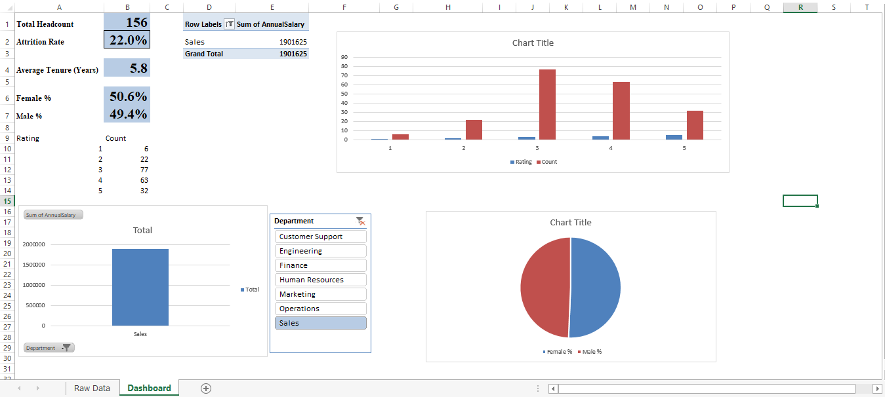

# HR KPI Excel Dashboard

An interactive HR analytics dashboard built in Microsoft Excel, tracking key
workforce metrics for a company of 200 employees.

## KPIs Tracked
- Total Headcount
- Attrition Rate
- Average Salary by Department
- Average Tenure (Years)
- Gender Diversity Split
- Performance Rating Distribution

## Tools & Skills Used
- PivotTables & PivotCharts
- COUNTIFS / AVERAGEIFS formulas
- Excel Tables (structured references)
- Slicers for interactive filtering
- Custom formatting and dashboard layout design

## Preview

## Data
Sample dataset of 200 employee records (synthetic data) including department,
job title, salary, hire/termination dates, and performance ratings.